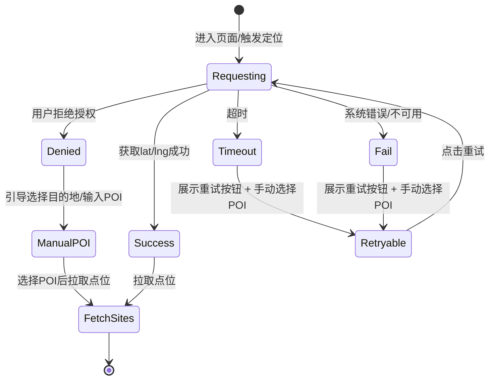
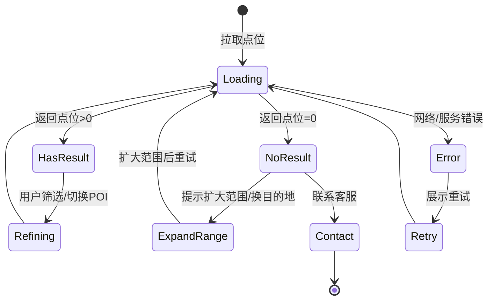
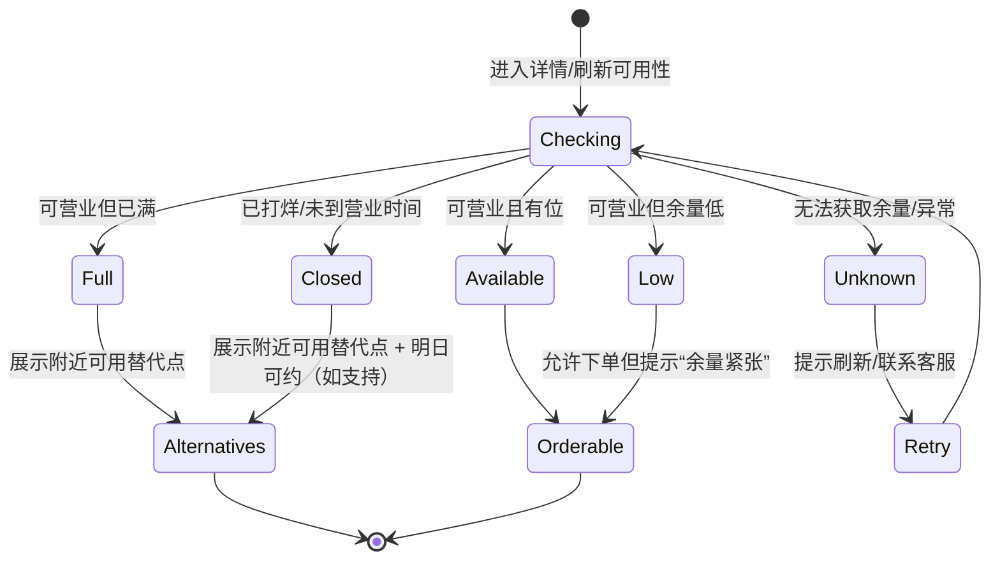
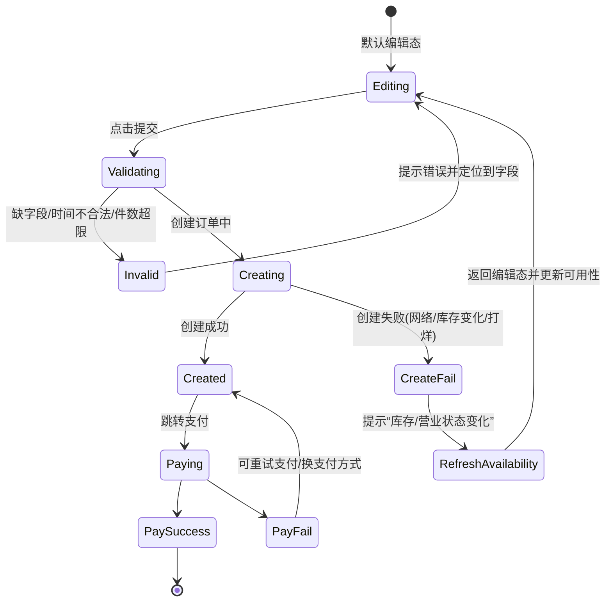
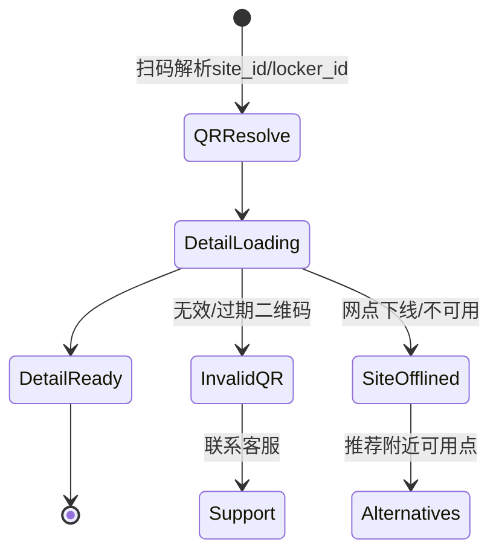

# 无忧存「承接推广流量」产品策划案 PRD v0.1

### 1. 背景与问题定义

*   当前获取的是大量**已确定要寄存的高意向用户**：手机端搜索+搜索广告≈56.7%，微信生态≈30%，线下扫码≈11.14%；但整体转化仅8–10%，问题在中间路径而非需求端。
    
*   漏斗最大断点在**地图→下单页**：启动→地图81.74%；地图→下单页19.96%（约80%止步）；下单页→支付成功53%；整体转化8.65%。
    
*   关键成因（报告结论）：  
    1）供给覆盖不足导致“打开地图无可用点”；2）信息表达不符合游客心智（缺地标/出口/步行时间）；3）为防挖点而隐藏位置/电话/环境图导致信任门槛过高；4）规则不清晰（尤其未使用扣费）与下单后指引/客服入口不明显。
    

### 2. 产品目标与验收指标

**北极星指标**

*   地图页→下单页转化率：19.96% → 阶段性提升至\*\*≥30%\*\*。
    

**阶段性业务指标**

*   启动→支付成功整体转化率：8–9% → **12–15%**。
    
*   “规则相关”客诉：尤其“未使用扣费”相关投诉显著下降。
    

---

## 3. 用户与核心场景

**核心用户画像**：女性为主，18–39岁占约80%，对“安全、规则、公平”敏感；线上消费能力与数字素养较高。

**典型场景（高意向触发点）**

*   到站/退房/准备进景区前产生寄存需求；更关注“顺路”，对安全与规则透明度要求高。
    

---

## 4. 目标用户路径（改造后）

### Path A：搜索/广告/内容投放（最大盘）

触达 → **推广承接页（默认推荐点）** → 网点详情（足够决策信息）→ 下单 → 支付 → 订单指引/客服 → 到店寄存/取回

### Path B：线下扫码（现场高意向）

扫码（绑定网点ID）→ **网点详情直达** → 下单 → 支付 → 到店操作

> 设计原则：把“探索型地图”变成“默认推荐+快速决策”，因为用户在地图阶段任务是“我在哪里/我要去哪/沿途有哪些点/哪个最顺路最安全”。

---

# 5. 产品方案总览（功能模块拆解）

1）推广承接页 + 深链归因  
2）线下扫码直达网点（缩短路径）  
3）地图页：强引导默认选点 + 卡片减法 + 场景筛选  
4）详情页：足够决策但不过度暴露（脱敏地址/商户类型/安全保障/联系方式中转/POI导航/局部真实图片）  
5）下单页：规则高亮（违约金包装）、取消/未使用策略、风险提示  
6）支付成功/订单页：三步指引、关键节点提醒、客服入口+FAQ  
7）埋点与A/B体系（验证转化提升与口碑风险下降）

> 报告明确给出的优化方向与行动路径：先最小改动打通线上闭环，再做示范城市与供给结构优化，并在保护网点前提下放大“透明与安全感”。

---

## 6. 详细PRD（页面/模块级）

## 6.1 推广承接页（Landing）+ 深链（最高优先级）

**目标**：减少用户进地图后的盲找与对比，把高意向流量直接导向“可下单的具体点”。（对应“地图→下单19.96%断点”）

### 6.1.1 入口与参数

*   入口：搜索广告、信息流、H5/链接、公众号菜单、分享链接等（投放归因依赖）。
    
*   参数（示例）：`campaign_id / kw / city / poi_id / scene`
    
    *   `poi_id`：目的地（地铁站/景区/商圈）
        
    *   `scene`：场景标签（到站/退房/景区/多行李）
        
    *   `campaign_id`：A/B分流与归因
        

### 6.1.2 页面结构（首屏完成决策）

1.  顶部：定位/目的地选择
    

*   默认：当前定位；可切换目的地（POI联想）
    
*   定位失败：展示热门POI列表（车站/景区）
    

1.  推荐点（1个，强引导）
    

*   明显“推荐”标识与短理由（例：步行3分钟·有监控·5.0分）
    
*   CTA：**直接下单（推荐点）**
    

1.  备选点（2个）
    

*   CTA：查看详情 / 选择该点下单
    

1.  兜底
    

*   打开地图自己选（弱化）
    
*   找不到合适点：切换目的地/联系客服
    

### 6.1.3 推荐逻辑（规则版即可上线）

*   过滤：营业中、当前时段可寄、可预约
    
*   排序：顺路性（到目标POI步行时间） > 可用性（营业覆盖） > 安全/保障标记 > 价格/评分
    

> 报告要求“推荐列表升级为强引导默认选点，并突出关键决策字段”。

### 6.1.4 埋点

*   `landing_show(kw,campaign_id,poi_id)`
    
*   `landing_reco_click / landing_alt_click / landing_open_map`
    
*   `landing_to_order / pay_success`
    

---

## 6.2 线下扫码直达网点（缩短路径）

**目标**：解决“线下扫码用户还要走地图选点、路径冗长”。

### 6.2.1 方案

*   每个柜体/门店二维码绑定 `site_id/locker_id`
    
*   扫码直达“该点详情页”（强提示：你就在这个点位）
    

### 6.2.2 异常兜底

*   若该点不可用（打烊/满柜/不可预约）：弹出最近可用替代点（1–3个）+ 一键导航
    

### 6.2.3 埋点

*   `qr_enter(site_id)` → `detail_show(source=qr)` → `detail_to_order`
    

---

## 6.3 地图页：强引导默认选点 + 卡片减法

**目标**：让用户一眼知道“如果不想纠结，选这个就行”，降低多点对比成本。

### 6.3.1 信息结构

*   顶部：当前位置/目的地输入（支持POI联想）
    
*   场景快捷筛选：车站/景区/商圈/酒店退房（与报告场景一致）
    
*   推荐区置顶：最优1–2个点“卡片强化”（边框/放大/置顶/标签）
    
*   列表区：其余点位
    

### 6.3.2 卡片字段（“减法”后的必留项）

报告明确“必留字段”：寄存类型、起价/典型价、营业时间覆盖、地标+出口+步行时间/距离、评分/平台保障标记。

*   必留：
    
    *   人工/自助
        
    *   起价或典型价 + 计费方式（按小时/按天）
        
    *   营业中/即将打烊（时间）
        
    *   地标+出口+步行时间（游客心智表达）
        
    *   安全/保障icon（监控/封签/专人/平台保障）
        
*   折叠：可过夜/专人寄存等次要标签（图标化或折叠）
    

### 6.3.3 弱网/性能策略（体验底线）

*   首屏先出“推荐列表+卡片”，地图瓦片延后加载，避免白屏导致退出（与“地图高停留、低转化”现象匹配）。
    

### 6.3.4 埋点

*   `map_show / map_stay_duration`
    
*   `reco_card_impression / reco_card_click`
    
*   `map_to_detail / map_to_order`（核心）
    

---

## 6.4 详情页：足够决策但不过度暴露（解决信任门槛）

报告指出“下单前看不到位置和电话”会显著降低信任；同时平台需要保护网点、防挖点。

### 6.4.1 预定前展示策略（三步折中）

报告建议：地址脱敏+导航精确、联系方式中转、图片“局部真实+整体抽象”。

**A. 地址脱敏展示**

*   展示到“楼栋/商圈 + 出入口 + 步行时间”，不展示门牌号（例：XX商圈·XX大厦附近·地铁A1口步行3分钟）。
    

**B. 商户类型增强正规感**

*   明示便利店/酒店/青旅/寄存店等。
    

**C. 联系方式中转**

*   展示平台统一客服/虚拟号/在线IM，由平台转接商户，避免裸露手机号列表。
    

**D. POI导航精确**

*   导航目标使用平台维护POI，降低竞品批量爬取。
    

**E. 图片策略**

*   展示寄存区域内部与安全设施，弱化商户品牌露出；后台素材库统一管理。
    

### 6.4.2 固定“安全与保障”模块（影响下单决策）

*   是否有监控/是否封签/是否专人看管
    
*   平台赔付上限与处理流程（简化版）
    

### 6.4.3 详情页埋点补齐

报告明确“网点详情无数据埋点”。

*   `detail_show(source)`、`detail_safety_expand`、`detail_contact_click`、`detail_nav_click`、`detail_to_order`
    

---

## 6.5 下单页：规则高亮与“被坑感”治理

报告指出规则表达晦涩、入口分散、费用条款埋得深；且用户明确提出“未使用扣手续费不合理”。

### 6.5.1 规则高亮（必须）

*   在“下单按钮附近”用清晰、友好的文案高亮提示（替代埋深规则）。
    

### 6.5.2 “违约金”包装（文案与结构）

*   统一为“预约保障/占位规则”（以服务保障逻辑解释）
    
*   三句话结构：为什么有、什么时候不收、如何避免（取消/改期入口）
    

### 6.5.3 新客缓冲（可A/B）

*   第一次使用未到店取消：可部分返还为平台优惠券（降低心理落差）。
    

### 6.5.4 埋点

*   `order_show`、`rule_impression`、`rule_expand`、`pay_click / pay_success / pay_fail_reason`
    

---

## 6.6 支付成功/订单页：三步指引 + 关键节点提醒 + 客服入口

报告指出下单后指引不清晰、无客服电话；并给出明确改法：三步流程、节点提醒、客服按钮+FAQ。

### 6.6.1 三步指引（固定模板）

1）点击导航前往【XX地铁站A1出口附近·XX大厦】  
2）到店出示寄存凭证，由店员确认  
3）取回时再次出示凭证即可取回行李

### 6.6.2 关键节点提醒

*   寄存开始前：提醒“不使用请尽快取消以避免费用”
    
*   结束前/超时：提醒“如需延长请操作/可能产生费用”
    

### 6.6.3 客服入口与FAQ

*   详情页与订单页提供显眼“平台客服/在线咨询”按钮
    
*   FAQ最少覆盖：取消/改期/找不到门店/申诉
    

---

## 6.7 数据归因、实验与监测（上线后如何证明有效）

### 6.7.1 关键监测指标（报告建议）

*   地图→下单转化（核心，目标≥30%）
    
*   地图平均停留时长：若决策难度降低，可能略降但转化上升为健康信号
    
*   规则与取消：取消率、未使用订单比例、规则相关工单量（尤其未使用扣费投诉）
    
*   整体转化与30天复购
    

### 6.7.2 A/B实验优先级

1）投放落地：直进地图 vs 推广承接页  
2）地图：强引导推荐点（强化1–2点） vs 现状列表  
3）详情：脱敏地址+中转联系+安全模块组合对“下单率/客诉”的影响  
4）规则：高亮文案 vs 高亮+新客缓冲券

---

## 7. 后台/运营支撑（产品侧必须补齐的“可控性”）

> 报告强调这是“产品×供给×BD策略”的系统问题，需要可配置、可灰度、可风控。

**建议新增/强化的后台能力（最小可用）**

1.  推荐点配置：按城市/POI/场景设“首推点、备选点”与有效期（用于承接页与地图推荐）
    
2.  网点信息模板化：强制字段（商圈/出口/步行时间/商户类型/营业覆盖）
    
3.  素材库：按网点上传“局部真实”图并支持批量替换
    
4.  规则配置与版本管理：支持对不同渠道/新客灰度不同规则文案与缓冲策略
    
5.  客诉看板与工单原因：找不到/规则/未使用扣费/超时等（和埋点打通）
    

---

## 8. 里程碑（按“最小改动先闭环”）

报告建议的行动路径：先打通线上闭环→示范城市样板→复制放量。

**Phase 1：承接闭环（MVP）**

*   推广承接页+归因埋点
    
*   扫码直达网点
    
*   地图推荐强化+卡片减法
    
*   详情页脱敏信息+安全模块+中转联系+POI导航
    
*   下单页规则高亮
    
*   成功/订单页三步指引+客服入口
    

**Phase 2：样板城市**

*   按景区/枢纽/酒店区建立POI模板与推荐点策略
    
*   规则缓冲策略A/B
    
*   客服与FAQ完善、节点提醒优化
    

**Phase 3：复制放量**

*   将“POI模板+推荐点配置+素材库+规则版本”复制到更多城市/场景
    

---

## 9. 风险与对策

1.  **网点被挖点风险**：用“脱敏地址+平台POI导航+联系方式中转+局部真实图片”折中处理。
    
2.  **供给不足导致承接页失效**：承接页需内置“无可用点兜底”（切换目的地/联系客服/附近备选）。
    
3.  **规则改革短期成本上升**：用A/B与灰度，优先压降“未使用扣费”负向记忆带来的投放口碑损耗。
    

---

如果你需要“可直接给研发评审”的版本，我可以把上述每个模块进一步拆成：页面字段清单、交互状态图（定位失败/无点位/打烊/满柜等）、事件埋点字典（参数表）、以及A/B实验的分流与口径定义。

## 1. 页面字段清单（PRD 级别）

> 说明：字段按“模块 → 字段”列出，并标注类型/来源/展示规则。可直接给设计与研发做对齐。

### A. 入口路由与参数（Deep Link / Scene）

用于把不同来源用户导入正确页面（承接页/网点详情/地图）。

**入参字段**

*   `source`（enum）：`ads_search | ads_feed | wechat | share | qr_site | qr_poster | organic_search`
    
*   `campaign_id`（string，可选）：投放计划ID
    
*   `kw`（string，可选）：关键词
    
*   `city_code`（string，可选）：城市编码
    
*   `poi_id`（string，可选）：目的地POI（站点/景区/商圈）
    
*   `scene`（enum，可选）：`station | scenic | hotel_checkout | multi_luggage | general`
    
*   `site_id`（string，可选）：网点ID（线下扫码直达）
    
*   `locker_id`（string，可选）：柜体/柜门ID（如有）
    
*   `ab_bucket`（string，可选）：实验分桶（也可由服务端下发）
    
*   `utm_*`（string，可选）：归因参数（如你们现有体系）
    

**路由规则（优先级）**

1.  `site_id/locker_id` 存在 → 直达 **网点详情页**
    
2.  否则 `campaign_id` 存在 → 进入 **推广承接页**
    
3.  否则 → 进入 **地图页**（默认当前定位）
    

---

## B. 推广承接页（Landing）

### B1. 顶部定位/目的地模块

*   `user_location_status`（enum）：`success | denied | timeout | fail`
    
*   `user_lat` / `user_lng`（number，可选）
    
*   `default_poi`（object，可选）
    
    *   `poi_id`（string）
        
    *   `poi_name`（string）
        
    *   `poi_type`（enum）：`station | scenic | mall | hotel | other`
        
*   `poi_input`（string）：输入框内容
    
*   `poi_suggest_list[]`（list）
    
    *   `poi_id`，`poi_name`，`distance_hint`（如“距你2.1km”）
        

**展示规则**

*   定位成功：默认“你在XX附近”
    
*   定位失败：展示“选择目的地” + 热门POI列表（本城Top N）
    

### B2. 推荐点模块（1个）

*   `reco_site`（object）
    
    *   `site_id`（string）
        
    *   `site_name`（string，脱敏名/简称）
        
    *   `site_type`（enum）：`manual | self_service`
        
    *   `biz_category`（enum）：`convenience | hotel | store | locker | other`
        
    *   `walk_time_min`（int）
        
    *   `landmark_text`（string）：`XX出口/XX门/XX广场旁`
        
    *   `open_status`（enum）：`open | closing_soon | closed`
        
    *   `close_time`（string，可选）
        
    *   `price_display`（string）：如“¥6起/小时”或“¥15起/天”
        
    *   `safety_badges[]`（list enum）：`cctv | staff | seal | platform_guarantee`
        
    *   `rating`（number，可选）
        
    *   `reco_reason`（string）：短理由（≤18字）
        
    *   `availability`（enum）：`available | low | full | unknown`
        
*   `cta_primary_text`（string）：默认“直接下单”
    
*   `cta_secondary`（string，可选）：如“查看详情”
    

**展示规则**

*   `open_status=closed` 或 `availability=full`：不允许作为“推荐点”，需回退为备选或触发“无可用点”状态
    

### B3. 备选点模块（2个）

字段同 `reco_site`，列表形式 `alt_sites[]`（最多2-3个）

### B4. 兜底入口模块

*   `open_map_btn`（button）
    
*   `contact_service_btn`（button）
    
*   `switch_poi_btn`（button）
    

---

## C. 地图页（Map）

### C1. 顶部搜索与筛选

*   `poi_input`（string）
    
*   `poi_selected`（object，可选）：同承接页
    
*   `filter_scene`（enum）：`station | scenic | mall | hotel_checkout | general`
    
*   `filter_type`（enum）：`all | manual | self_service`
    
*   `filter_open`（bool）：仅营业中
    
*   `filter_overnight`（bool，可选）：可过夜（可折叠）
    
*   `filter_price_max`（number，可选）
    

### C2. 推荐区（置顶 1-2 个）

*   `top_reco_sites[]`（list，最多2）字段同 `reco_site`
    
*   `cta_reco_order`（button）：直接下单（针对第1推荐点）
    

### C3. 点位列表区（N个）

*   `site_list[]`（list）字段同 `reco_site`（不需要全部字段展示，但数据层可保留）
    

### C4. 地图呈现层（可延迟加载）

*   `map_tile_status`（enum）：`loading | ready | fail`
    
*   `pin_list[]`（list）：`site_id, lat, lng, pin_style(reco/normal)`
    

### C5. 状态提示/异常入口

*   `no_result_panel`（object）：无结果提示 + “换目的地/扩大范围/联系客服”
    
*   `location_retry_btn`
    
*   `network_retry_btn`
    

---

## D. 网点详情页（Detail）

### D1. 顶部概览（首屏决策）

*   `site_id`
    
*   `site_type`（manual/self\_service）
    
*   `biz_category`
    
*   `landmark_text`（强制）
    
*   `walk_time_min`（强制）
    
*   `open_status`（open/closing\_soon/closed）
    
*   `today_hours`（string）：如“今日 08:00-23:00”
    
*   `price_display`（string）
    
*   `availability`（available/low/full/unknown）
    
*   `cta_order_btn`（button）
    

### D2. 安全与保障模块（固定）

*   `safety_badges[]`
    
*   `guarantee_summary`（string）：平台保障一句话
    
*   `compensation_link`（link，可选）
    

### D3. 到店指引模块

*   `nav_btn`（button）
    
*   `nav_poi_id`（string）：用于精确导航（平台维护POI）
    
*   `guide_steps[]`（list string）：1-3条短指引（出口/门/标识物）
    

### D4. 联系方式模块（中转）

*   `contact_channels[]`（list enum）：`online_im | hotline | virtual_call`
    
*   `contact_btn`（button）
    
*   `service_time`（string，可选）
    

### D5. 图片模块（局部真实）

*   `images[]`（list）：`url, type(storage_area/cctv/entrance_hint)`
    
*   `image_disclaimer`（string，可选）
    

### D6. 规则摘要模块（强制可见）

*   `rule_summary`（string）：1-2行
    
*   `rule_detail_link`（link）
    

---

## E. 下单页（Order）

### E1. 订单输入

*   `site_id`
    
*   `date`（date）
    
*   `start_time` / `end_time`（time，可选，看你们计费逻辑）
    
*   `duration`（number）
    
*   `item_count`（int）
    
*   `item_type`（enum）：`backpack | suitcase | large | mixed`
    
*   `capacity_hint`（string，可选）：如“此点支持28寸箱”
    

### E2. 价格与权益

*   `price_breakdown[]`（list）：基础费/服务费/保障费（若有）
    
*   `total_price`（number）
    
*   `coupon_select`（object，可选）
    
*   `new_user_policy`（object，可选）：新客缓冲/返券说明（A/B）
    

### E3. 规则高亮（下单按钮附近）

*   `rule_highlight`（string，强制）
    
*   `cancel_window`（string）：可免费取消窗口（如有）
    
*   `no_show_policy`（string）：未使用处理说明
    
*   `ack_checkbox`（bool，可选）：必要时增加“我已了解”勾选
    

### E4. CTA

*   `submit_order_btn`
    
*   `pay_btn`（若先创建订单再支付）
    

---

## F. 支付成功页 / 订单详情页（Post-order）

### F1. 三步指引（固定）

*   `step_1_nav_btn`
    
*   `step_2_show_code`（按钮）：出示凭证/二维码
    
*   `step_3_pickup_rule`（文字）
    

### F2. 订单信息

*   `order_id`
    
*   `site_name`（脱敏名）
    
*   `landmark_text`
    
*   `service_time_range`
    
*   `support_contact_btn`
    

### F3. 关键节点提醒（订阅/通知）

*   `subscribe_msg_btn`（button，可选）
    
*   `remind_rules[]`（list）：开始前/结束前/超时提醒策略
    

---

# 2. 交互状态图（定位失败 / 无点位 / 打烊 / 满柜等）

> 以“状态机 + 转移条件”方式给出，可直接转为研发逻辑与测试用例。

## 2.1 定位获取状态机（全局）

**页面级表现（承接页/地图页通用）**

*   `Denied/Timeout/Fail`：默认展示“选择目的地”+ 热门POI + “重试定位”
    
*   `Success`：默认展示“你在XX附近”，并自动拉取推荐点/列表
    

---

## 2.2 点位结果状态机（承接页/地图页）

**无点位（NoResult）时的必备文案与动作**

*   文案：`该区域暂时没有可用寄存点`
    
*   CTA1：`换目的地`（推荐最近车站/景区POI）
    
*   CTA2：`扩大范围`（例如 500m→1.5km）
    
*   CTA3：`联系客服帮你找`（运营兜底）
    

---

## 2.3 网点可用性状态机（详情页/下单页核心）

**UI/交互规则（必须明确）**

*   `Available`：CTA=“立即下单”
    
*   `Low`：CTA=“立即下单”，但按钮上方提示“余量紧张，建议尽快下单”
    
*   `Full`：CTA置灰或变为“查看附近可用点”（禁止下单）
    
*   `Closed`：CTA变为“查看附近营业点”；如支持预约未来时间，则提供“预约明日/选择时间”
    
*   `Unknown`：CTA=“刷新重试”，并提供“联系客服”
    

---

## 2.4 下单提交状态机（下单页）

**关键异常（CreateFail）分类提示**

*   `库存变化导致满`：提示“刚刚被抢完”，跳转替代点
    
*   `打烊/营业变更`：提示“已打烊”，提供附近点/改时间
    
*   `网络失败`：提示“网络异常”，重试
    

---

## 2.5 扫码直达状态机（线下二维码）

---

# 3. 你可以直接拿去做测试用例的“状态覆盖清单”

按页面列出必须覆盖的状态（建议作为QA验收表）：

*   承接页/地图页
    
    *   定位：成功 / 拒绝 / 超时 / 失败
        
    *   点位：有结果 / 无结果 / 拉取失败可重试
        
    *   筛选后：从有结果→无结果、无结果→有结果切换
        
*   详情页
    
    *   营业：营业中 / 即将打烊 / 已打烊
        
    *   余量：有位 / 余量低 / 满柜 / 未知
        
    *   导航：可唤起 / 唤起失败（提示复制地址/客服）
        
*   下单页
    
    *   校验失败（缺字段/时间不合法/件数超限）
        
    *   创建订单失败：网络/满柜/打烊（分别提示与兜底）
        
    *   支付失败可重试
        
*   扫码
    
    *   有效码直达
        
    *   无效/过期码
        
    *   网点下线/不可用 → 替代点兜底
        

---

如果你希望我继续补齐到“可交付研发”的颗粒度，我可以在下一版把每个状态对应的：页面文案（中文）、按钮行为、以及埋点事件与参数（用于归因与漏斗分析）一起给出。